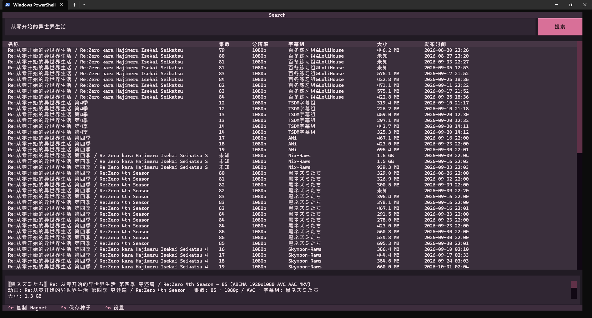

# AnimeBT v1.0.0

八源动漫 BT 搜索终端工具。解压后运行 AnimeBT.exe。

- 点击表头排序。
- Ctrl+C 复制磁链；Ctrl+S 保存种子。
- Ctrl+O 设置目录和主题；Ctrl+R 刷新；Ctrl+Q 退出。
- 配置、缓存、日志自动创建于 `%LOCALAPPDATA%/AnimeBT`。

源码运行：`pip install .` 后执行 `python -m animebt`（Python 3.11+）。
构建：`tools/build.ps1 -Python python`（Windows x64）。

仅用于有权获取的资源，请遵守版权法律和来源站点规则。
